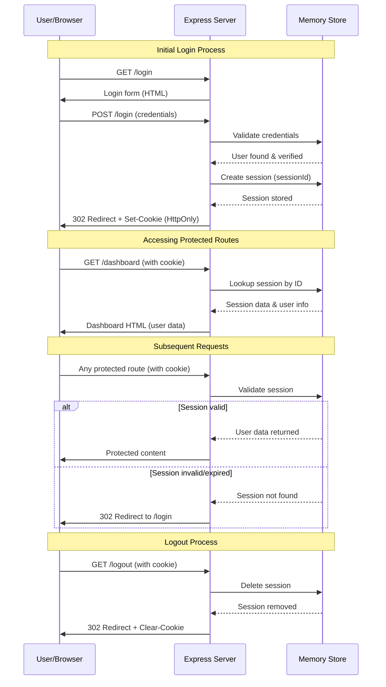

# Learn Cookie - Cookie Authentication Demo

A simple Node.js web application demonstrating cookie-based session management and authentication.

## Features

- Express.js web server
- Cookie-based session authentication
- EJS templating engine
- In-memory user database (for learning purposes)
- Login/logout functionality
- Protected dashboard route

## Installation

1. Install dependencies:
```bash
npm install
```

## Running the Application

### Using nodemon (auto-restart):
```bash
npm start
```

### Using Node.js built-in watch flag (Node.js 18+):
```bash
node --watch index.js
```

### Standard run:
```bash
node index.js
```

The server will start on port 8000.

## Configuration

### Local Host Setup

To use a custom domain for testing:

1. Edit your hosts file:
```bash
sudo nano /etc/hosts
```

2. Add the following line:
```
127.0.0.1 chapter-testcookie.com
```

3. Access the application at `http://chapter-testcookie.com:8000`

## Test Credentials

- **Username:** chapter@gmail.com
- **Password:** Chapter@123

## Routes

- `/` - Home page
- `/login` - Login page
- `/dashboard` - Protected dashboard (requires authentication)
- `/logout` - Logout and clear session

## Security Notes

This is a learning project with simplified security practices:
- Uses in-memory session storage
- Hardcoded test credentials
- Basic HttpOnly cookie implementation

## The Cookie Authentication Flow

